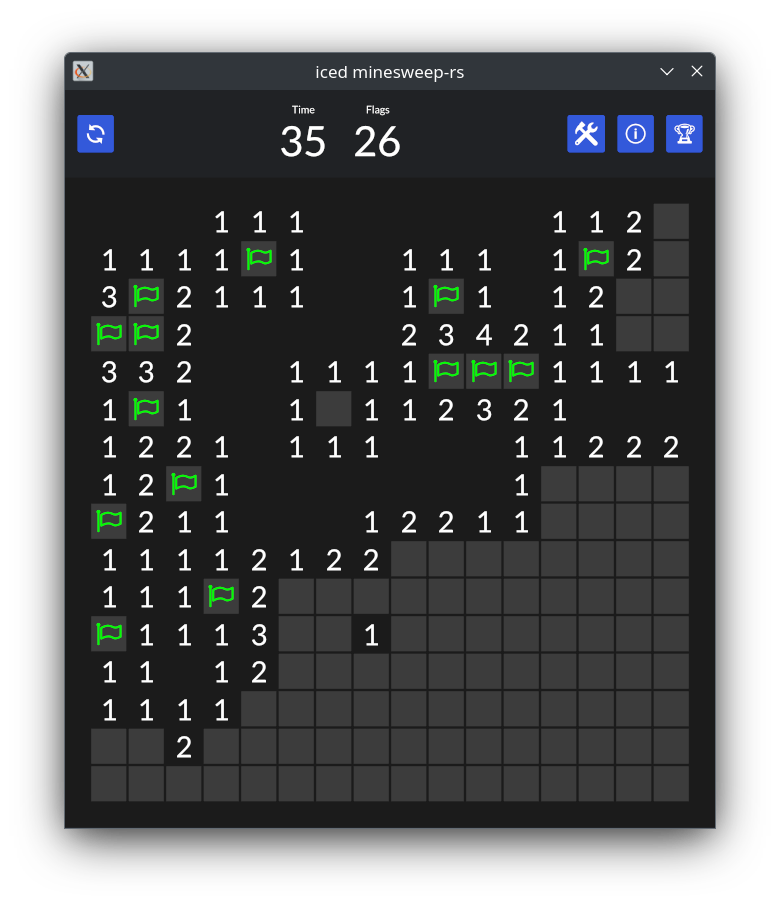

# Iced minesweep-rs

A rust implementation of the popular game, using the [iced](https://github.com/iced-rs/iced) library.



## TODO

- [x] Linux / Windows
- [ ] WASM
- [x] Config
- [x] High scores
- [x] Layout

## Build & run

### Desktop

Prerequisites: `cargo` and `rustc` (see [installation instructions](https://www.rust-lang.org/tools/install))

Build and run:

```bash
git clone https://github.com/BogdanOlar/iced-minesweep-rs
cd iced-minesweep-rs/
cargo run --release
```

### Wasm

TODO:

## License

[MIT](./LICENSE)
